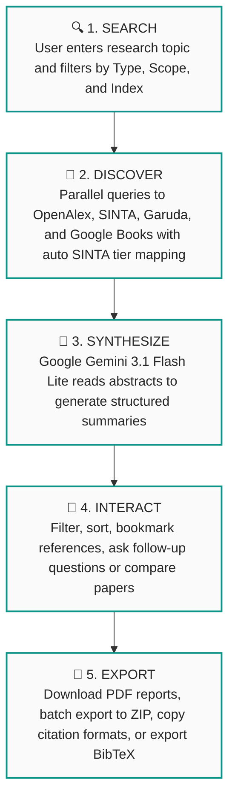
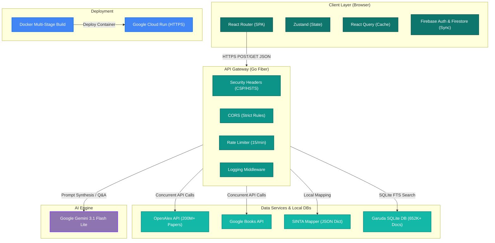
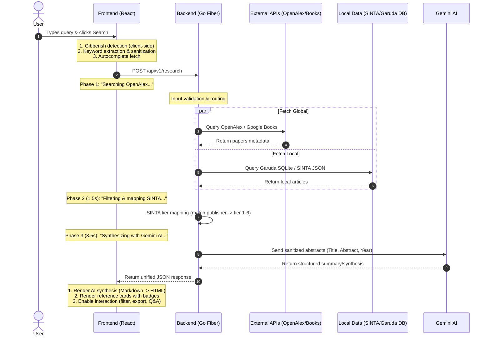

# Fuenzer Research 🔬


<p align="center">
  <a href="README.md">🇮🇩 Indonesia</a> | <a href="README.en.md">🌐 English</a>
</p>

> **Academic Research, AI-Synthesized** — An AI-powered scientific research assistant designed to help Indonesian academics search, map SINTA/Garuda indexes, and instantly synthesize national and global scientific literature.

**Live Demo:** [https://research.fuenzer.web.id](https://research.fuenzer.web.id)

Built for **JuaraVibeCoding Season 1** Hackathon by Google.

---

## 📋 Table of Contents

- [The Problem We Solve](#-the-problem-we-solve)
- [Our Solution](#-our-solution)
- [What Makes Us Unique](#-what-makes-us-unique)
- [Full Architecture](#-full-architecture)
- [Features](#-features)
- [Tech Stack](#️-tech-stack)
- [Getting Started](#-getting-started)
- [Project Structure](#-project-structure)
- [Security](#-security)
- [License](#-license)

---

## 🎯 The Problem We Solve

> **Assessment Criteria #1 — Problem (30%)**

### Target Audience

Fuenzer Research is built for **Indonesian academics, undergraduate/graduate/doctoral students, and active researchers** who face systemic bottlenecks in the literature review process:

| Problem | Impact |
|---------|--------|
| No tool automatically maps **SINTA (1-6)** tiers | Researchers must manually look up journals on the official SINTA website to assess quality |
| The **Garuda** database (national research portal) is hard to query programmatically | Thousands of Indonesian articles remain unexposed to modern research tools |
| Global research tools (Elicit, Semantic Scholar) **lack understanding of the Indonesian academic ecosystem** | Indonesian researchers are forced to use multiple fragmented platforms |
| Reading 10-20 abstracts for a literature review takes **2-4 hours** | Research time is wasted on repetitive tasks that AI can easily automate |

### Why It Matters Now

- **300,000+ graduate students** and **100,000+ lecturers** in Indonesia need fast access to accredited literature
- SINTA, as the national accreditation standard, **is not integrated** with any research tools automatically
- The AI era enables literature synthesis in seconds — yet no platform has tailored this for the Indonesian academic context

### Scale & Impact Potential

> ### 🎯 TARGET MARKET
>
> * 🎓 **300K+** Indonesian Master's/Ph.D. Students
> * 👨‍🏫 **100K+** Active Lecturers & Researchers
> * 📚 **15,456** SINTA-Accredited Journals
> * 📄 **3.6M+** Articles in the Garuda Database
> * 🌍 **200M+** Global Publications (OpenAlex)
>
> Fuenzer Research bridges the gap between local Indonesian academic indexes and global research tools — a connection left unaddressed by other platforms.

---

## 💡 Our Solution

> **Assessment Criteria #2 — Solution (40%)**

### User Experience (UX)

Fuenzer Research is designed under the **"Zero Friction Research"** philosophy — users can start researching in 3 seconds with zero registration required:

| UX Aspect | Implementation |
|-----------|----------------|
| **Intuitive** | Search bar directly in the hero section, zero sign-up required. "Did you mean?" autocomplete powered by OpenAlex |
| **Delightful** | 3-phase narrative skeleton loader ("Searching → Filtering → Synthesizing"), rotating text animations, glassmorphism cards |
| **Responsive** | Full mobile support — split-screen AI panel switches to full-screen on mobile with clean breakpoint handling |
| **Dark Mode** | Full implementation with a robust design token system (Fuenzer Teal, Cloud Canvas, Ink Black, etc.) |
| **Bilingual (i18n)** | The entire UI is available in both Indonesian and English — toggleable in real-time |
| **Accessible** | Semantic HTML, adequate color contrast ratios, and keyboard navigation support |

### Value Proposition

Here are the **concrete results** Fuenzer Research delivers:

| Without Fuenzer Research | With Fuenzer Research |
|--------------------------|-----------------------|
| Open SINTA → manual check → 15 mins per journal | Automatic SINTA mapping in <1 second |
| Open 3-4 separate platforms (Scholar + SINTA + Garuda + Books) | 1 search query → 4 sources queried simultaneously |
| Read 10 abstracts → 2-3 hours for literature review | AI synthesis in <5 seconds |
| Copy-paste citations manually to different styles | 5 citation styles (APA/Harvard/MLA/Chicago/Vancouver) + BibTeX export |
| Cannot compare multiple papers at once | AI Compare: select references → query AI for direct comparison |

### Complete Workflow



---

## ✨ What Makes Us Unique

> **Assessment Criteria #3 — Uniqueness (30%)**

### Originality

Fuenzer Research **is not a ChatGPT wrapper** and **does not use templates**. Here is what sets us apart:

| Aspect | Detail |
|-------|--------|
| **SINTA Auto-Mapping** | The only platform that automatically maps SINTA tiers (1-6) onto search results. No other research tool offers this integration |
| **Garuda SQLite (652K)** | We curated 652,144 articles from the national Garuda database into a local SQLite DB — a significant data engineering effort for Indonesian research accessibility |
| **Custom Design System** | No Material UI / Chakra / templates. Handcrafted from scratch: Firecrawl-inspired aesthetics using unique token colors, typography, and custom layouts |
| **Dual AI Mode** | Search Mode (discover new literature) + Ask Mode (query AI about selected references) in a single interactive panel |
| **Anti-Hallucination Pipeline** | AI synthesizes findings strictly from the provided abstracts, preventing external knowledge hallucinations. Temperature set to 0.3 + strict academic prompts |

### The "Wow" Factor — Elegant AI Integration

> ### 🤖 BEYOND BASIC "API CALLS"
>
> 1. **Narrative Skeleton Loader**
>    * 3-phase loading animation (`Searching...` → `Filtering...` → `Synthesizing...`) keeps the user visually engaged.
> 2. **Token Economy**
>    * We strip unnecessary fields and send only `Title` + `Abstract` + `Year` to Gemini, saving 70% in tokens and reducing latency.
> 3. **Anti-Prompt Injection**
>    * Rigid system prompts prevent Gemini from complying with user override attempts.
> 4. **Graceful Degradation**
>    * If Gemini fails, the app still renders the references list without the synthesis (user is never blocked).
> 5. **Gibberish Detection (Frontend + Backend)**
>    * Detects keyboard mashing and nonsensical input before calling the AI, preventing resource abuse.
> 6. **Contextual Q&A**
>    * Select 3 papers → ask "compare methodologies" → AI answers using ONLY the abstracts of those chosen papers.

### Authentic Handcrafted Project

- **Zero UI templates** — no admin dashboards, landing page templates, or starter kits.
- **Custom animations** — word-flip-in, marquee tracks, number scramble, and intersection observer fade-ins.
- **Bespoke Design** — design token system inspired by Firecrawl.dev adapted specifically for academic environments.
- **Data Engineering** — curated and cleaned 3.6M Garuda articles down to 652K high-quality publications (filtered from 2024 onwards).

---

## 🏛️ Full Architecture

### System Architecture Diagram



### Request Flow (Sequence)



### Why is this Stack Fast?

| Layer | Technology | Performance Advantage |
|-------|-----------|-----------------------|
| **Bundler** | Vite 8 (ESBuild) | 10-100x faster than Webpack. HMR updates in <50ms |
| **Routing** | React Router (SPA) | Navigation between pages is 0ms (component swapping in memory) |
| **State** | Zustand | ~1KB, zero boilerplate, selective component re-rendering |
| **Cache** | React Query (staleTime: 5min) | Data cached locally — navigate back and forth without re-fetching |
| **Backend** | Go Fiber | Zero allocation HTTP, local logic execution in <5ms |
| **Concurrency** | Go Goroutines | Handles 100K+ concurrent requests efficiently (vs Node's single thread) |
| **Cold Start** | Alpine binary ~50MB | Cloud Run cold starts in <200ms (vs Node's 500-2000ms) |
| **AI** | Gemini Flash Lite | Google's fastest model — optimized for low-latency inference |

---

## ⚡ Features

| Feature | Description |
|---------|-------------|
| 🔍 **Multi-Source Search** | One query searches OpenAlex (200M+ papers), Google Books, SINTA, and Garuda |
| 🇮🇩 **SINTA Auto-Mapping** | Automatic mapping of Indonesian journal tiers (SINTA 1-6) onto search results |
| 🤖 **AI Synthesis** | Google Gemini 3.1 Flash Lite generates structured literature reviews in <5 seconds |
| 💬 **Dual AI Mode** | Search Mode (literature search) + Ask Mode (Q&A about selected references) |
| 📂 **PDF & BibTeX Export** | Export references to PDF reports, batch ZIP exports, and BibTeX (.bib) format |
| 📚 **Library & Bookmark** | Save references, synced across devices via Firebase Firestore |
| 🎨 **Dark Mode + i18n** | Beautiful light/dark themes + full bilingual support (ID/EN) |
| 🔒 **Anti-Hallucination** | Temp 0.3, strict prompt guidelines, answers generated strictly from abstract context |
| 🛡️ **Security-First** | Rate limiter, strict CORS, CSP headers, DOMPurify, gibberish validation |
| ⚡ **Narrative Loader** | 3-phase animated loading keeping users visually engaged |

---

## 🛠️ Tech Stack

| Layer | Technology |
|-------|-----------|
| Frontend | React 19, TypeScript 6, Vite 8 |
| Styling | Tailwind CSS 4.3, Custom Design Token System |
| UI Components | Lucide React, Glassmorphism, Custom Animations |
| State Management | Zustand 5 (global state), TanStack React Query 5 (server cache) |
| Authentication | Firebase Auth 12 (Google, Microsoft, Email) |
| Cloud Storage | Firebase Firestore (history & bookmark sync) |
| PDF & Export | jsPDF 4.2, JSZip 3.10, BibTeX generator |
| Markdown Rendering | Marked 18 + DOMPurify 3 (XSS-safe) |
| Backend API | Golang 1.25, Fiber (high-performance REST framework) |
| AI Engine | Google Gemini 3.1 Flash Lite (temperature 0.3) |
| Data Sources (Global) | OpenAlex API, Google Books API |
| Data Sources (Local) | SINTA JSON dict, Garuda SQLite DB |
| Deployment | Docker Multi-Stage, Google Cloud Run, Alpine 3.19 |
| Security | Strict CORS, Rate Limiting 15/min, CSP Headers, HSTS |

### Detailed Dependency Versions

| Package | Version | Role |
|---------|---------|------|
| `react` | 19.2.6 | UI library |
| `react-dom` | 19.2.6 | DOM rendering |
| `react-router-dom` | 7.15.1 | Client-side SPA routing |
| `typescript` | 6.0.2 | Type safety |
| `vite` | 8.0.16 | Build tool & dev server |
| `@vitejs/plugin-react` | 6.0.1 | React Fast Refresh |
| `tailwindcss` | 4.3.0 | Utility-first CSS |
| `zustand` | 5.0.13 | State management |
| `@tanstack/react-query` | 5.100.14 | Server state caching |
| `firebase` | 12.14.0 | Auth + Database SDK |
| `axios` | 1.16.1 | HTTP client |
| `lucide-react` | 1.16.0 | Icon library |
| `marked` | 18.0.4 | Markdown parser |
| `dompurify` | 3.4.11 | XSS sanitization |
| `jspdf` | 4.2.1 | PDF generation |
| `jszip` | 3.10.1 | ZIP packaging |
| `go` | 1.25 | Backend language |
| `gofiber/fiber` | v2 | HTTP framework |
| `gofiber/limiter` | v2 | Rate limit middleware |
| `gofiber/cors` | v2 | CORS middleware |
| `joho/godotenv` | latest | Env variable loader |

---

## 🚀 Getting Started

### Prerequisites

- Node.js 20+
- Go 1.22+
- Google AI Studio API Key (Gemini)
- Google Books API Key (optional)

### Frontend Installation

```bash
cd frontend
npm install
npm run dev
```

Frontend runs on `http://localhost:5173`

### Backend Installation

```bash
cd backend
cp .env.example .env
# Edit .env and fill in GEMINI_API_KEY and GOOGLE_BOOKS_API_KEY
go mod tidy
go run ./cmd/api
```

Backend runs on `http://localhost:8080`

### Docker (Production)

```bash
docker build -t fuenzer-research .
docker run -p 8080:8080 \
  -e GEMINI_API_KEY=your_key \
  -e GOOGLE_BOOKS_API_KEY=your_books_key \
  -e ENV=production \
  fuenzer-research
```

---

## 📁 Project Structure

```text
/fuenzer-research
├── /frontend                    # React SPA (Vite + TypeScript + Tailwind CSS 4)
│   ├── /public                  # Static assets (favicon, OG image, logos)
│   ├── /src
│   │   ├── /assets              # Logo images (SINTA, Garuda, Scopus, etc.)
│   │   ├── /components
│   │   │   ├── /home            # Landing page components (HeroBackground, etc.)
│   │   │   ├── /playground      # Playground-specific (AIAssistantPanel)
│   │   │   └── /shared          # Reusable (Navbar, Footer, JournalCard, CookieConsent, etc.)
│   │   ├── /hooks               # Custom React hooks (useSEO, etc.)
│   │   ├── /lib                 # Firebase config, Firestore helpers
│   │   ├── /locales             # i18n translations (en.ts, id.ts)
│   │   ├── /pages               # Route pages
│   │   │   ├── /auth            # Authentication pages (Login, SignUp, VerifyEmail, ResetPassword)
│   │   │   ├── LandingPage.tsx
│   │   │   ├── PlaygroundPage.tsx
│   │   │   ├── LibraryPage.tsx
│   │   │   ├── CitationsPage.tsx
│   │   │   ├── TermsPage.tsx
│   │   │   ├── PrivacyPage.tsx
│   │   │   └── NotFoundPage.tsx
│   │   ├── /services            # API client (axios → backend)
│   │   ├── /store               # Zustand stores (research, auth, UI)
│   │   ├── /types               # TypeScript interfaces
│   │   ├── /utils               # Helpers (PDF export, keyword extractor)
│   │   ├── App.tsx              # Root component + React Router
│   │   └── main.tsx             # Entry point
│   ├── package.json
│   └── vite.config.ts
├── /backend                     # Go Fiber REST API
│   ├── /cmd/api/main.go         # Entry point — server setup + middleware
│   ├── /internal
│   │   ├── /config              # Environment variables loader
│   │   ├── /handlers            # HTTP route handlers (research, ask, autocomplete)
│   │   ├── /models              # Go structs (request/response types)
│   │   └── /services
│   │       ├── /gemini          # Google Gemini AI SDK integration
│   │       ├── /openalex        # OpenAlex API client (works, sources, autocomplete)
│   │       ├── /googlebooks     # Google Books API client
│   │       ├── /garuda          # Garuda SQLite local database client
│   │       └── /sinta           # SINTA tier dictionary mapper
│   └── /data                    # Static data (sinta_journals_data.json, garuda.db)
├── /docs                        # Architecture docs, design guidelines, progress log
├── Dockerfile                   # Multi-stage production build
├── DESIGN.md                    # Visual design system specification
├── AGENTS.md                    # AI coding assistant configuration
└── README.md                    # Main README (Indonesian)
```

---

## 🔒 Security

| Layer | Implementation |
|-------|----------------|
| **CORS** | Strict whitelist: `localhost:5173` and `research.fuenzer.web.id` only |
| **Rate Limiting** | 15 requests/minute per IP (protecting Gemini API quota) |
| **Security Headers** | HSTS, X-Frame-Options, CSP, X-Content-Type-Options, Referrer-Policy, Permissions-Policy |
| **Input Validation** | Query 3-200 chars, strict scope and type checks |
| **Gibberish Detection** | Dual-layer: Frontend vowel checks and keyboard mash detection + Backend regex pattern checks |
| **XSS Prevention** | DOMPurify sanitizes Markdown output from the AI |
| **Anti-Prompt Injection** | Explict rules in Gemini system prompts to ignore override attempts |
| **API Key Protection** | API keys stored securely in Go backend environment — never exposed to clients |
| **Auth** | Firebase Auth (Google + Microsoft + Email) + anonymous session fallbacks |

---

## 📄 License

Licensed under the [Apache 2.0](LICENSE) License.

---

<div align="center">
  <p><strong>Made with 🧠 + ☕ for JuaraVibeCoding Season 1 by Google</strong></p>
  <p><em>Fuenzer Research — Accelerating Indonesian Academic Discovery with AI</em></p>
</div>
