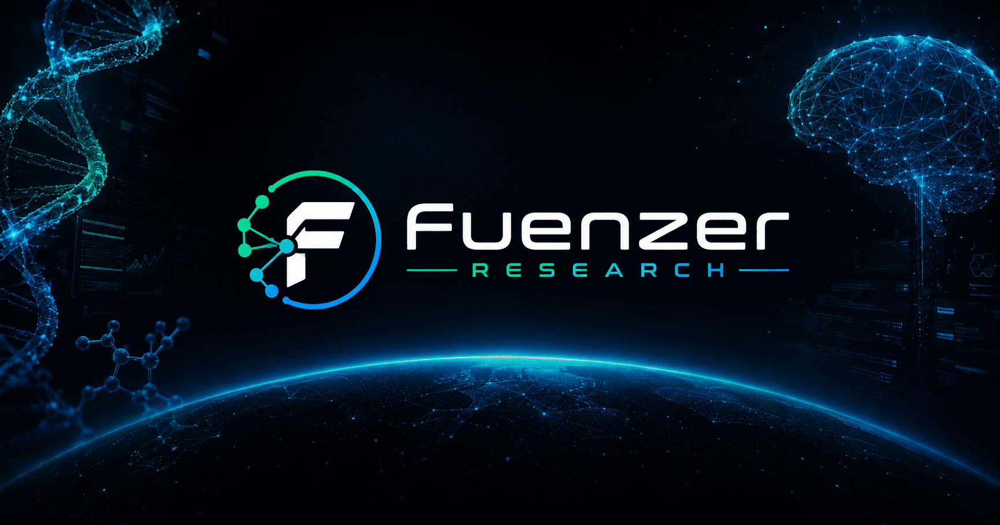
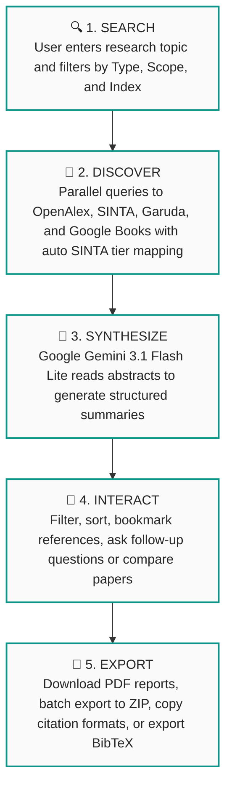
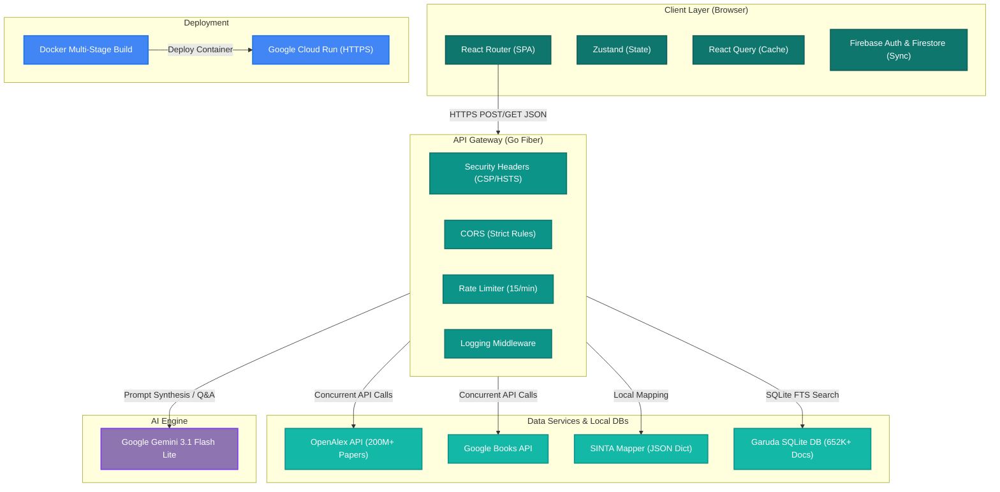
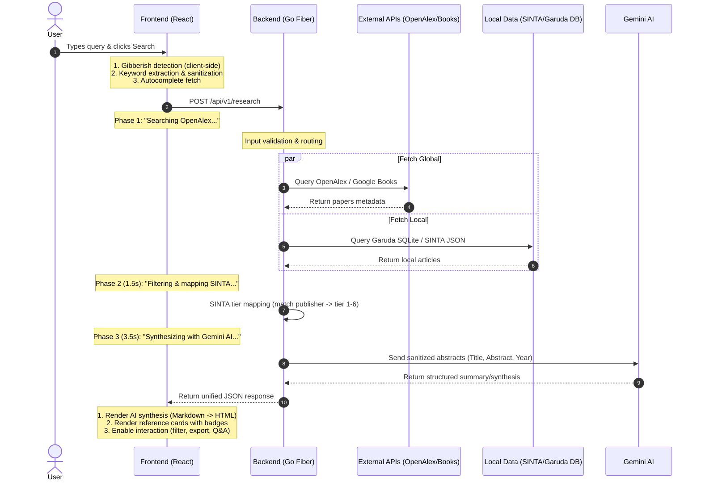

# Fuenzer Research 🔬




> **Riset Akademis, Disintesis AI** — Asisten riset ilmiah bertenaga kecerdasan buatan untuk membantu akademisi Indonesia mencari, memetakan indeks SINTA/Garuda, dan menyintesis literatur ilmiah skala nasional & global secara instan.

**Live Demo:** [https://research.fuenzer.web.id](https://research.fuenzer.web.id)

Built for **JuaraVibeCoding Season 1** Hackathon by Google.

---

## 📋 Table of Contents

- [The Problem We Solve](#-the-problem-we-solve)
- [Our Solution](#-our-solution)
- [What Makes Us Unique](#-what-makes-us-unique)
- [Full Architecture](#-full-architecture)
- [Features](#-features)
- [Tech Stack](#️-tech-stack)
- [Getting Started](#-getting-started)
- [Project Structure](#-project-structure)
- [Security](#-security)
- [License](#-license)

---

## 🎯 The Problem We Solve

> **Kriteria Penilaian #1 — Masalah / Problem (30%)**

### Target Audiens

Fuenzer Research dibangun untuk **akademisi, mahasiswa S1/S2/S3, dan peneliti Indonesia** yang menghadapi hambatan sistemik dalam proses riset literatur:

| Masalah | Dampak |
|---------|--------|
| Tidak ada tool yang memetakan tier **SINTA (1-6)** secara otomatis | Peneliti harus cek manual satu per satu di situs SINTA untuk menentukan kualitas jurnal |
| Database **Garuda** (portal riset nasional) sulit di-search secara programatik | Ribuan artikel Indonesia tidak terekspos ke tool riset modern |
| Tool riset global (Elicit, Semantic Scholar) **tidak mengenal ekosistem akademik Indonesia** | Peneliti Indonesia terpaksa menggunakan banyak platform terpisah |
| Membaca 10-20 abstrak untuk literature review memakan **2-4 jam** | Waktu riset terbuang untuk tugas repetitif yang bisa diotomasi AI |

### Mengapa Ini Penting Sekarang

- **300.000+ mahasiswa pascasarjana** dan **100.000+ dosen** di Indonesia membutuhkan akses cepat ke literatur terakreditasi
- SINTA sebagai standar akreditasi nasional **tidak terintegrasi** dengan tools riset manapun secara otomatis
- Era AI memungkinkan sintesis literatur dalam hitungan detik — tetapi belum ada yang melakukannya untuk konteks Indonesia

### Potensi Skala (Impact)

> ### 🎯 TARGET PASAR
>
> * 🎓 **300K+** Mahasiswa S2/S3 Indonesia
> * 👨‍🏫 **100K+** Dosen & Peneliti Aktif
> * 📚 **15.456** Jurnal Terakreditasi SINTA
> * 📄 **3.6M+** Artikel di Database Garuda
> * 🌍 **200M+** Publikasi Global (OpenAlex)
>
> Fuenzer Research menjembatani kesenjangan antara indeks akademis lokal Indonesia dengan tools riset global — sesuatu yang belum dilakukan platform lain.


---

## 💡 Our Solution

> **Kriteria Penilaian #2 — Solusi / Solution (40%)**

### User Experience (UX)

Fuenzer Research dirancang dengan filosofi **"Zero Friction Research"** — pengguna bisa mulai riset dalam 3 detik tanpa perlu registrasi:

| Aspek UX | Implementasi |
|----------|-------------|
| **Intuitif** | Search bar langsung di hero section, zero sign-up required. Autocomplete "Did you mean?" dari OpenAlex |
| **Delightful** | Narrative skeleton loader 3 fase ("Searching → Filtering → Synthesizing"), animasi rotating text, glassmorphism cards |
| **Responsif** | Full mobile support — AI panel full-screen di mobile, breakpoint handling di setiap komponen |
| **Dark Mode** | Implementasi penuh dengan design token system (Fuenzer Teal, Cloud Canvas, Ink Black, dll) |
| **Bilingual (i18n)** | Seluruh UI tersedia dalam Bahasa Indonesia dan English — bisa di-toggle secara real-time |
| **Accessible** | Semantic HTML, contrast ratio yang memadai, keyboard navigation support |

### Proposisi Nilai (Value Proposition)

Berikut **hasil nyata** yang Fuenzer Research berikan kepada pengguna:

| Tanpa Fuenzer Research | Dengan Fuenzer Research |
|----------------------|------------------------|
| Buka SINTA → cek tier manual → 15 menit per jurnal | Pemetaan SINTA otomatis dalam <1 detik |
| Buka 3-4 platform terpisah (Scholar + SINTA + Garuda + Books) | 1 search query → 4 sumber sekaligus |
| Baca 10 abstrak → 2-3 jam untuk literature review | AI synthesis dalam <5 detik |
| Copy-paste sitasi manual ke berbagai format | 5 format sitasi (APA/Harvard/MLA/Chicago/Vancouver) + BibTeX export |
| Tidak bisa compare multiple papers sekaligus | AI Compare: pilih referensi → tanya AI tentang perbandingan |

### Workflow Lengkap




---

## ✨ What Makes Us Unique

> **Kriteria Penilaian #3 — Keunikan / Uniqueness (30%)**

### Orisinalitas

Fuenzer Research **bukan wrapper ChatGPT** dan **bukan template standar**. Berikut yang membedakan kami:

| Aspek | Detail |
|-------|--------|
| **SINTA Auto-Mapping** | Satu-satunya platform yang secara otomatis memetakan tier SINTA (1-6) ke hasil pencarian literatur. Tidak ada tool riset manapun yang melakukan ini |
| **Garuda SQLite 652K** | Kami mengkurasi 652.144 artikel dari database Garuda ke SQLite lokal — effort data engineering yang signifikan untuk aksesibilitas riset Indonesia |
| **Custom Design System** | Bukan Material UI / Chakra / template. Kami mendesain dari nol: Firecrawl-inspired aesthetic dengan token warna, tipografi, dan komponen unik |
| **Dual AI Mode** | Search Mode (cari literatur baru) + Ask Mode (tanya AI tentang referensi terpilih) dalam satu panel interaktif |
| **Anti-Hallucination Pipeline** | AI hanya menjawab berdasarkan abstrak yang diberikan, bukan pengetahuan umum. Temperature 0.3 + strict academic prompt |

### Faktor "Wow" — Penggunaan AI yang Elegan

> ### 🤖 AI USAGE YANG TIDAK SEKADAR "CALL API"
>
> 1. **Narrative Skeleton Loader**
>    * 3-phase loading (`Searching...` → `Filtering...` → `Synthesizing...`) membuat pengguna tetap engaged.
> 2. **Token Economy**
>    * Hanya kirim `Title` + `Abstract` + `Year` ke Gemini, menghemat 70% token vs mengirim full paper data.
> 3. **Anti-Prompt Injection**
>    * System prompt melarang Gemini mengikuti instruksi dari user yang mencoba override.
> 4. **Graceful Degradation**
>    * Jika Gemini gagal → tetap return referensi tanpa synthesis (user tidak stuck).
> 5. **Gibberish Detection (Frontend + Backend)**
>    * Deteksi keyboard mashing sebelum memanggil AI untuk menghemat kuota & mencegah abuse.
> 6. **Contextual Q&A**
>    * User pilih 3 papers → tanya "bandingkan metodologi" → AI menjawab HANYA dari abstrak papers yang dipilih.


### Bukan Template — Bukti Orisinalitas

- **Zero UI library template** — tidak menggunakan admin dashboard template, landing page template, atau starter kit
- **Custom animations** — word-flip-in, marquee tracks, number scramble, fade-in with intersection observer
- **Design dari scratch** — design token system terinspirasi Firecrawl.dev dengan adaptasi untuk konteks akademis
- **Data engineering** — mengkurasi & membersihkan 3.6M artikel Garuda menjadi 652K yang berkualitas (filter tahun 2024)

---

## 🏛️ Full Architecture

### System Architecture Diagram



### Request Flow (Sequence)




### Kenapa Stack Ini Cepat?

| Layer | Teknologi | Keunggulan Performa |
|-------|-----------|-------------------|
| **Bundler** | Vite 8 (ESBuild) | 10-100x lebih cepat dari Webpack. HMR <50ms |
| **Routing** | React Router (SPA) | Navigasi antar halaman = 0ms (swap komponen di memori) |
| **State** | Zustand | ~1KB, no boilerplate, selective re-render |
| **Cache** | React Query (staleTime: 5min) | Data di-cache — navigasi bolak-balik tanpa re-fetch |
| **Backend** | Go Fiber | Zero allocation HTTP, response <5ms untuk logic lokal |
| **Concurrency** | Go Goroutines | Handle 100K+ concurrent requests (vs Node.js single-thread) |
| **Cold Start** | Alpine binary ~50MB | Cloud Run cold start <200ms (vs Node.js 500-2000ms) |
| **AI** | Gemini Flash Lite | Model tercepat Google — optimized untuk low-latency inference |

---

## ⚡ Features

| Fitur | Deskripsi |
|-------|-----------|
| 🔍 **Multi-Source Search** | Satu query → OpenAlex (200M+ papers) + Google Books + SINTA (~700 journals) + Garuda (652K articles) |
| 🇮🇩 **SINTA Auto-Mapping** | Pemetaan otomatis tier jurnal Indonesia (SINTA 1-6) — fitur unik yang tidak dimiliki platform lain |
| 🤖 **AI Synthesis** | Google Gemini 3.1 Flash Lite menghasilkan ringkasan literatur terstruktur dalam <5 detik |
| 💬 **Dual AI Mode** | Search Mode (cari referensi baru) + Ask Mode (Q&A tentang referensi terpilih) |
| 📂 **PDF & BibTeX Export** | Export referensi ke PDF individual atau batch ZIP + BibTeX (.bib) untuk LaTeX |
| 📚 **Library & Bookmark** | Simpan referensi favorit ke library personal, sync via Firebase across devices |
| 🎨 **Dark Mode + i18n** | Tema gelap/terang + bilingual penuh (ID/EN) |
| 🔒 **Anti-Hallucination** | Temperature 0.3, strict prompt, AI hanya menjawab dari data yang diberikan |
| 🛡️ **Security-First** | Rate limiting, CORS strict, CSP headers, DOMPurify, gibberish detection |
| ⚡ **Narrative Loader** | 3-phase animated loading yang membuat pengguna tetap engaged saat menunggu |

---

## 🛠️ Tech Stack

| Layer | Technology |
|-------|-----------|
| Frontend | React 19, TypeScript 6, Vite 8 |
| Styling | Tailwind CSS 4.3, Custom Design Token System |
| UI Components | Lucide React, Glassmorphism, Custom Animations |
| State Management | Zustand 5 (global state), TanStack React Query 5 (server cache) |
| Authentication | Firebase Auth 12 (Google, Microsoft, Email) |
| Cloud Storage | Firebase Firestore (history & bookmark sync) |
| PDF & Export | jsPDF 4.2, JSZip 3.10, BibTeX generator |
| Markdown Rendering | Marked 18 + DOMPurify 3 (XSS-safe) |
| Backend API | Golang 1.25, Fiber (REST API berkinerja tinggi) |
| AI Engine | Google Gemini 3.1 Flash Lite (temperature 0.3) |
| Data Sources (Global) | OpenAlex API (200M+ publications), Google Books API |
| Data Sources (Lokal) | SINTA JSON (~700 jurnal, tier 1-6), Garuda SQLite (652K+ artikel) |
| Deployment | Docker Multi-Stage, Google Cloud Run, Alpine 3.19 |
| Security | CORS strict, Rate Limiting 15/min, CSP Headers, HSTS |

### Detailed Dependency Versions

| Package | Version | Role |
|---------|---------|------|
| `react` | 19.2.6 | UI library |
| `react-dom` | 19.2.6 | DOM rendering |
| `react-router-dom` | 7.15.1 | Client-side SPA routing |
| `typescript` | 6.0.2 | Type safety |
| `vite` | 8.0.16 | Build tool & dev server |
| `@vitejs/plugin-react` | 6.0.1 | React Fast Refresh |
| `tailwindcss` | 4.3.0 | Utility-first CSS |
| `zustand` | 5.0.13 | Lightweight state management |
| `@tanstack/react-query` | 5.100.14 | Server state & caching |
| `firebase` | 12.14.0 | Auth + Firestore |
| `axios` | 1.16.1 | HTTP client |
| `lucide-react` | 1.16.0 | Icon library |
| `marked` | 18.0.4 | Markdown parser |
| `dompurify` | 3.4.11 | XSS sanitization |
| `jspdf` | 4.2.1 | PDF generation |
| `jszip` | 3.10.1 | ZIP packaging |
| `go` | 1.25 | Backend language |
| `gofiber/fiber` | v2 | HTTP framework |
| `gofiber/limiter` | v2 | Rate limiting middleware |
| `gofiber/cors` | v2 | CORS middleware |
| `joho/godotenv` | latest | Environment loader |

---

## 🚀 Getting Started

### Prerequisites

- Node.js 20+
- Go 1.22+
- Google AI Studio API Key (Gemini)
- Google Books API Key (optional)

### Frontend Installation

```bash
cd frontend
npm install
npm run dev
```

Frontend berjalan di `http://localhost:5173`

### Backend Installation

```bash
cd backend
cp .env.example .env
# Edit .env → tambahkan GEMINI_API_KEY dan GOOGLE_BOOKS_API_KEY
go mod tidy
go run ./cmd/api
```

Backend berjalan di `http://localhost:8080`

### Docker (Production)

```bash
docker build -t fuenzer-research .
docker run -p 8080:8080 \
  -e GEMINI_API_KEY=your_key \
  -e GOOGLE_BOOKS_API_KEY=your_books_key \
  -e ENV=production \
  fuenzer-research
```

---

## 📁 Project Structure

```text
/fuenzer-research
├── /frontend                    # React SPA (Vite + TypeScript + Tailwind CSS 4)
│   ├── /public                  # Static assets (favicon, OG image, logos)
│   ├── /src
│   │   ├── /assets              # Logo images (SINTA, Garuda, Scopus, etc.)
│   │   ├── /components
│   │   │   ├── /home            # Landing page components (HeroBackground, etc.)
│   │   │   ├── /playground      # Playground-specific (AIAssistantPanel)
│   │   │   └── /shared          # Reusable (Navbar, Footer, JournalCard, CookieConsent, etc.)
│   │   ├── /hooks               # Custom React hooks (useSEO, etc.)
│   │   ├── /lib                 # Firebase config, Firestore helpers
│   │   ├── /locales             # i18n translations (en.ts, id.ts)
│   │   ├── /pages               # Route pages
│   │   │   ├── /auth            # Authentication pages (Login, SignUp, VerifyEmail, ResetPassword)
│   │   │   ├── LandingPage.tsx
│   │   │   ├── PlaygroundPage.tsx
│   │   │   ├── LibraryPage.tsx
│   │   │   ├── CitationsPage.tsx
│   │   │   ├── TermsPage.tsx
│   │   │   ├── PrivacyPage.tsx
│   │   │   └── NotFoundPage.tsx
│   │   ├── /services            # API client (axios → backend)
│   │   ├── /store               # Zustand stores (research, auth, UI)
│   │   ├── /types               # TypeScript interfaces
│   │   ├── /utils               # Helpers (PDF export, keyword extractor)
│   │   ├── App.tsx              # Root component + React Router
│   │   └── main.tsx             # Entry point
│   ├── package.json
│   └── vite.config.ts
├── /backend                     # Go Fiber REST API
│   ├── /cmd/api/main.go         # Entry point — server setup + middleware
│   ├── /internal
│   │   ├── /config              # Environment variables loader
│   │   ├── /handlers            # HTTP route handlers (research, ask, autocomplete)
│   │   ├── /models              # Go structs (request/response types)
│   │   └── /services
│   │       ├── /gemini          # Google Gemini AI SDK integration
│   │       ├── /openalex        # OpenAlex API client (works, sources, autocomplete)
│   │       ├── /googlebooks     # Google Books API client
│   │       ├── /garuda          # Garuda SQLite local database client
│   │       └── /sinta           # SINTA tier dictionary mapper
│   └── /data                    # Static data (sinta_journals_data.json, garuda.db)
├── /docs                        # Architecture docs, design guidelines, progress log
├── Dockerfile                   # Multi-stage production build
├── DESIGN.md                    # Visual design system specification
├── AGENTS.md                    # AI coding assistant configuration
└── README.md                    # This file
```

---

## 🔒 Security

| Layer | Implementasi |
|-------|-------------|
| **CORS** | Strict whitelist: hanya `localhost:5173` dan `research.fuenzer.web.id` |
| **Rate Limiting** | 15 requests/menit per IP (melindungi Gemini quota) |
| **Security Headers** | HSTS, X-Frame-Options, CSP, X-Content-Type-Options, Referrer-Policy, Permissions-Policy |
| **Input Validation** | Query 3-200 karakter, scope validation, type validation |
| **Gibberish Detection** | Dual-layer: frontend (vowel check + keyboard mash) + backend (pattern matching) |
| **XSS Prevention** | DOMPurify untuk sanitasi output Markdown dari AI |
| **Anti-Prompt Injection** | System prompt dengan instruksi eksplisit untuk menolak override attempts |
| **API Key Protection** | Semua API keys tersimpan di backend — tidak pernah exposed ke client |
| **Auth** | Firebase Auth (Google + Microsoft + Email) + anonymous session fallback |

---

## 📄 License

Dilindungi di bawah lisensi [Apache 2.0](LICENSE).

---

<div align="center">
  <p><strong>Made with 🧠 + ☕ for JuaraVibeCoding Season 1 by Google</strong></p>
  <p><em>Fuenzer Research — Accelerating Indonesian Academic Discovery with AI</em></p>
</div>
