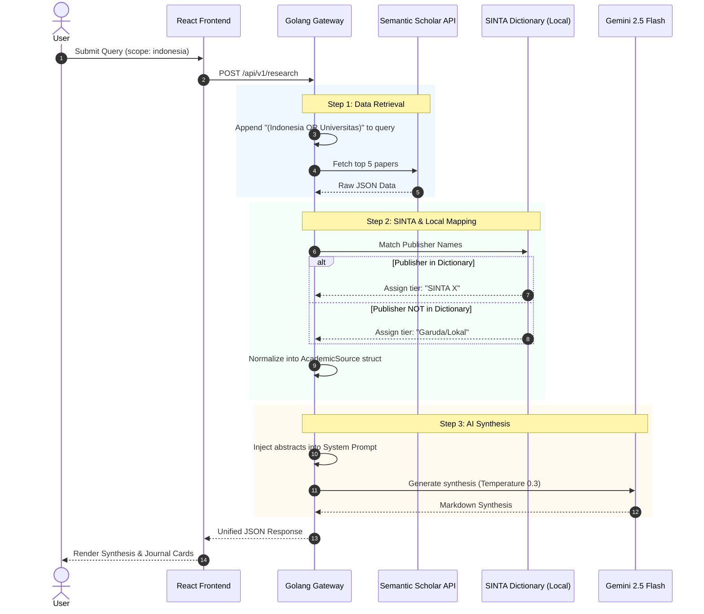

# API & Data Flow Rules

## 1. Separation of Concerns
The Frontend React application **NEVER** communicates directly with Google AI Studio (Gemini) or Semantic Scholar API. This exposes API keys and violates security. The Golang backend acts as the sole API Gateway and Orchestrator.

## 2. End-to-End Search Orchestration Diagram

## 3. SINTA Filtering Logic (NO AI INVOLVED)

**CRITICAL**: Do NOT ask Gemini to filter SINTA 1 vs SINTA 2. AI is unreliable for discrete database filtering.

- **Data Source**: Since SINTA does not have a public API, all retrieval uses the **Semantic Scholar API**.
- **Query Modification**: When a user selects the "Indonesia/SINTA" tab, the Golang backend automatically appends keywords like `AND (Indonesia OR Universitas)` to the query to force local results.
- **Dictionary Mapping**: In the backend (`/data/sinta_data.json`), we maintain a hardcoded map containing 30-50 popular IT/Health journals in Indonesia and their SINTA tiers.
- **Evaluation**: 
  - If `journal.publisher` matches an entry in our dictionary, set tier to "SINTA X" (e.g., SINTA 2).
  - If no match, assign the tier as "Garuda/Lokal".
- **Extensibility**: The response JSON uses a generic `indexes` array (`[{provider: "sinta", tier: "SINTA 2"}]`) instead of a hardcoded `sinta_tier` field. This enables future integrations seamlessly.

## 4. Error States & Handling

- **Timeout**: If Semantic Scholar API takes > 8 seconds, abort and return a 504 status. Frontend displays: "Database timeout. Please try again."
- **Empty Results**: If 0 journals are found, do NOT call Gemini. Immediately return 200 OK with synthesis: "No relevant papers found." and empty references.