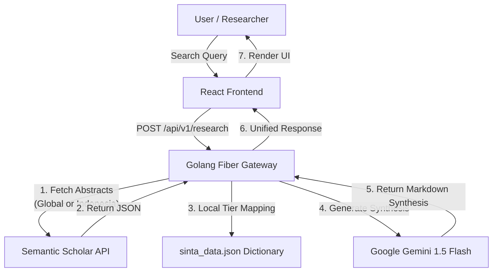

# Architecture Manifesto: Fuenzer Research

## 1. Core Tech Stack

- **Frontend Environment**: React 18, initialized via Vite for lightning-fast HMR.
- **Frontend Language**: TypeScript (Strict mode enabled).
- **Styling**: Tailwind CSS + shadcn/ui (Radix UI primitives).
- **State Management**: Zustand (for global state like selected SINTA filters) + React Query (for caching API responses from the backend).
- **Backend Framework**: Golang 1.22+ using Fiber (Express-inspired, extremely fast HTTP engine).
- **AI Engine**: Google Gemini 1.5 Flash (via Google Gen AI SDK for Go).
- **External Data Source**: Semantic Scholar API.
- **Deployment**: Dockerized containers on Google Cloud Run.

## 2. System Architecture Diagram



## 3. Monorepo Directory Structure (Strict Enforcement)

You MUST strictly follow this folder architecture. Do not deviate or create redundant folders.

```text
/fuenzer-research (Root)
├── /frontend
│   ├── /public            # Static assets (Favicon, Fuenzer Logo)
│   ├── /src
│   │   ├── /assets        # Local images/icons
│   │   ├── /components
│   │   │   ├── /ui        # ALL shadcn/ui components go here
│   │   │   └── /shared    # Reusable custom components (Navbar, Footer, SkeletonLoader)
│   │   ├── /features      # Domain-specific modules
│   │   │   ├── /chat      # ChatBubble, AIActionChips
│   │   │   ├── /search    # GlobalSearchBar, SintaToggle
│   │   │   └── /workspace # JournalCard, FilterDropdown, ReferenceList
│   │   ├── /hooks         # Custom React Hooks
│   │   ├── /lib           # Utility functions (e.g., Tailwind merge)
│   │   ├── /pages         # Main view layouts (LandingPage, PlaygroundPage)
│   │   ├── /services      # Axios/Fetch instances calling Go Backend
│   │   ├── /store         # Zustand store slices
│   │   ├── /types         # TypeScript interfaces
│   │   ├── App.tsx        
│   │   └── main.tsx       
│   ├── tailwind.config.js
│   ├── tsconfig.json
│   └── package.json
├── /backend
│   ├── /cmd
│   │   └── /api           # Main entry point (main.go)
│   ├── /internal          # Private application code
│   │   ├── /config        # Environment variables loader
│   │   ├── /handlers      # HTTP route handlers (e.g., SearchHandler)
│   │   ├── /models        # Go structs for JSON parsing (AcademicSource, SynthesisResponse)
│   │   ├── /services      # Core business logic
│   │   │   ├── /gemini    # AI Prompt construction & SDK calls
│   │   │   ├── /scholar   # Semantic Scholar API integration
│   │   │   └── /sinta     # Local dictionary mapper for SINTA tiers
│   │   └── /utils         # Helper functions
│   ├── /data
│   │   └── sinta_data.json # Hardcoded dictionary of 30-50 Indonesian journals
│   ├── .env               
│   ├── Dockerfile         
│   ├── go.mod
│   └── go.sum
└── README.md
```

## 4. Communication & API Contracts

Frontend and Backend communicate via REST JSON over HTTP.

**Endpoint**: `POST /api/v1/research`

**Request Payload**:
```json
{
  "query": "pengaruh AI dalam interaksi manusia dan komputer",
  "scope": "indonesia" // or "global"
}
```

**Response Payload**:
```json
{
  "synthesis": "Interaksi Manusia dan Komputer (IMK) mengalami pergeseran paradigma...",
  "references": [
    {
      "id": "12345",
      "title": "Implementasi Paradigma Interaksi Manusia & Komputer...",
      "authors": ["Lolanda Hamim Annisa", "Yudha Herlambang"],
      "year": 2022,
      "publisher": "Technology and Informatics Insight Journal",
      "indexes": [
         { "provider": "sinta", "tier": "SINTA 2" }
      ],
      "url": "https://doi.org/..."
    }
  ],
  "latency_ms": 1204
}
```

## 5. Engineering Principles & Rules

- **Component-Driven**: Build UI elements in isolation before composing them into pages.
- **Type Safety**: Ensure Frontend interfaces (`/types`) perfectly match the Backend JSON responses (`/models`). Use `any` strictly as a last resort.
- **Error Handling**: Frontend must gracefully handle backend timeouts or empty arrays with narrative skeleton loaders or empty states.
- **Port Configuration**: During local development, Frontend runs on `http://localhost:5173` and Backend runs on `http://localhost:8080`. Backend MUST configure CORS to allow requests from the Frontend port.